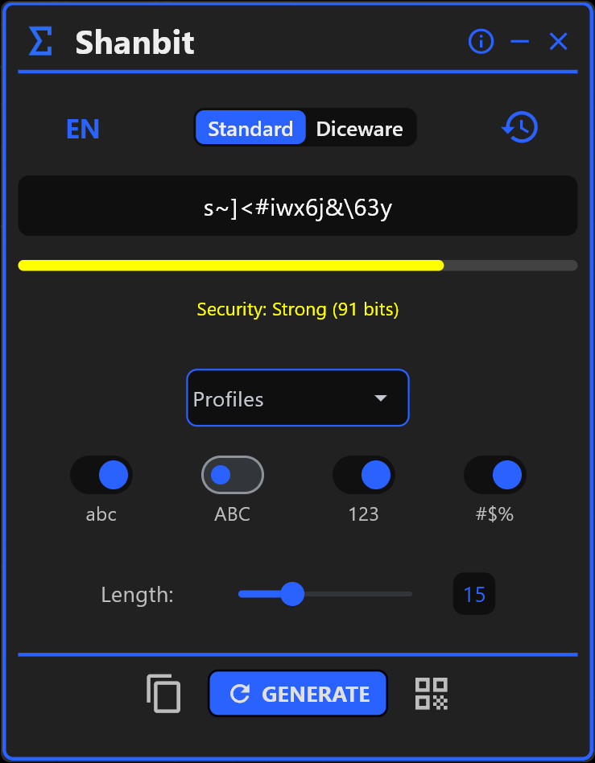
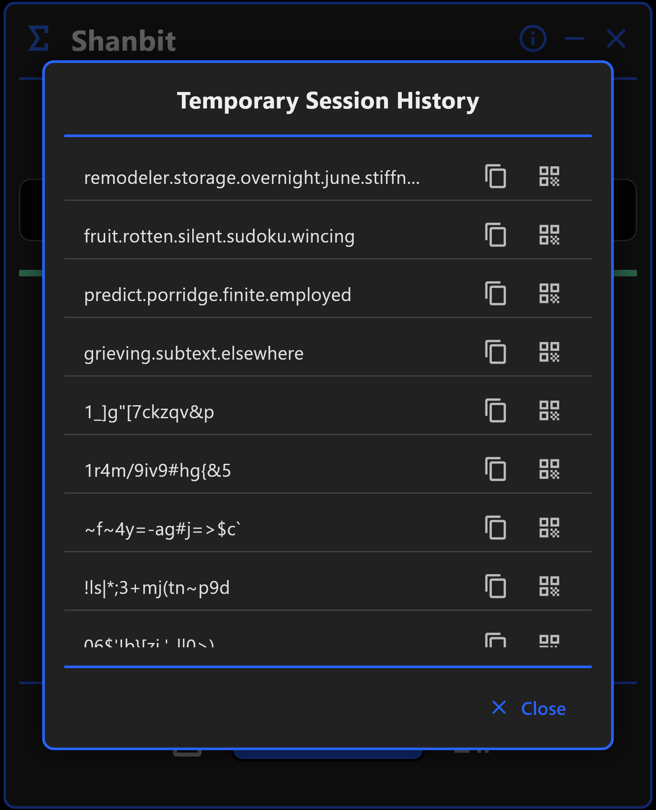
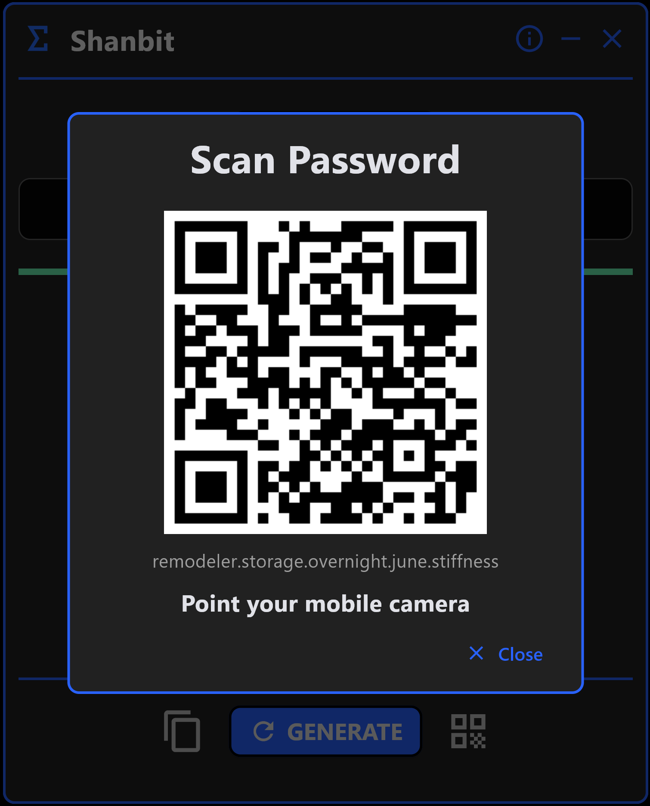
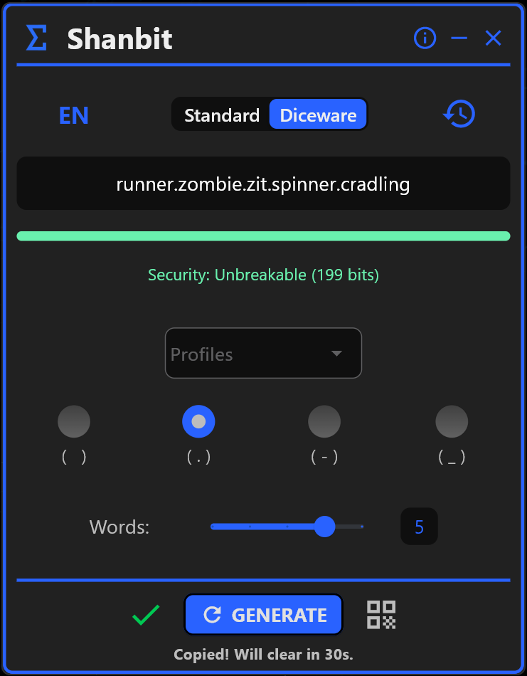

  

# Shanbit 🛡️

**Native desktop application for generating cryptographic keys and Diceware passphrases.**

Shanbit is a professional tool built with **Python** and **Flet**, designed under the "Total Privacy" principle. Unlike web-based generators, it operates 100% offline and manages sensitive data exclusively in volatile memory (RAM).

---

## 🛠️ Tech Stack & Architecture

* **Language:** Python 3.x
* **UI Framework:** Flet (Flutter-based)
* **Cryptographic Security:** `secrets` module (CSPRNG)
* **Concurrency:** `threading` for automatic clipboard clearing.
* **Distribution:** Native packaging compatible with the Microsoft Store.

---

## 🧠 Technical Highlights

### 1. High-Entropy Generation
The application implements **Shannon's Entropy Formula** to calculate the actual strength of each generated key, analyzing the character pool size ($R$) and the string length ($L$).

$$E = L \times \log_2(R)$$

* **Real-time visualization** with chromatic feedback based on security bits.
* **Classification** ranging from "Very Weak" (< 40 bits) to "Unbreakable" (> 100 bits).

  

### 2. Memory & Clipboard Security
To prevent forensic analysis of sensitive data:
* **Volatile History:** The password history resides strictly in RAM and is wiped upon closing the process.
* **Clipboard Auto-Clear:** Implementation of a background thread (`threading.Timer`) that automatically clears the system clipboard after 30 seconds of inactivity.

  

### 3. Secure QR Transfer
Implementation of logic to transfer keys to mobile devices without relying on networks or cloud services. The QR code is generated as an **in-memory Base64 string**, avoiding the creation of temporary files on the hard drive that could be recovered.

  

### 4. Multi-language Diceware Generation
Support for memorable passphrases using optimized word lists in **Spanish** and **English**, selected via `secrets.choice` to ensure maximum statistical randomness.

  

---

## 📂 Project Structure (Business Logic)

* `backend.py`: Cryptographic engine, entropy calculation, and QR generation.
* `main.py`: App state management, life cycles, and thread orchestration.
* `view.py`: Definition of the reactive UI and modals.
* `constantes.py`: Diceware dictionaries and I18n localization system.

---

## 👨‍💻 Note for Recruiters
This repository contains the documentation and technical specifications for the project. The full source code is the property of **PybloSoft** and is maintained in a private repository for commercial reasons, as the product is distributed under a one-time purchase model on the Microsoft Store. 

If you would like to discuss specific details regarding the implementation of the security logic or the software architecture, please feel free to contact me.

---

© 2026 **PybloSoft** | [Technical Support](mailto:support@pyblosoft.com)